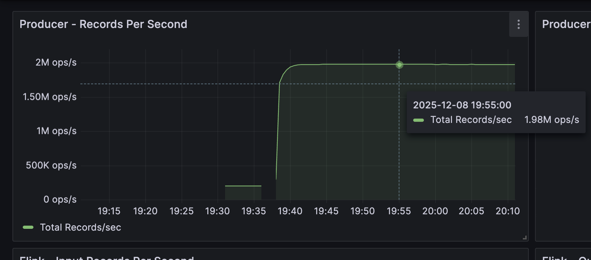
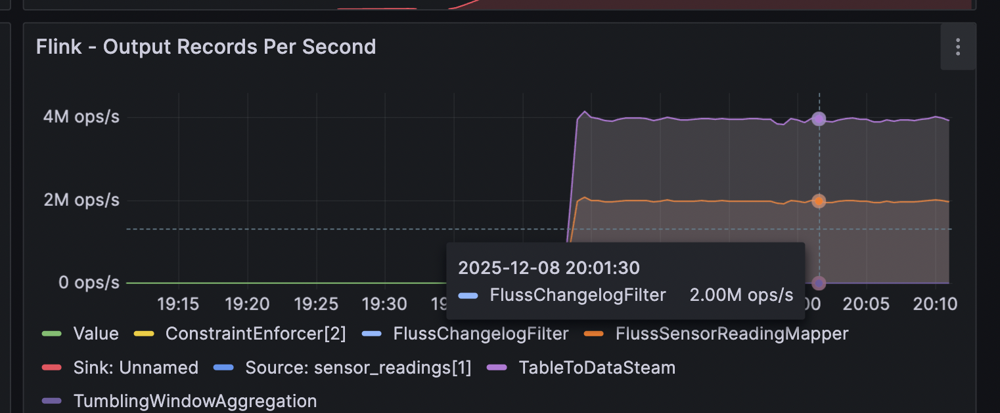
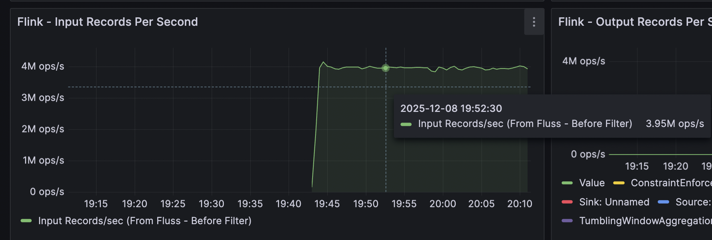
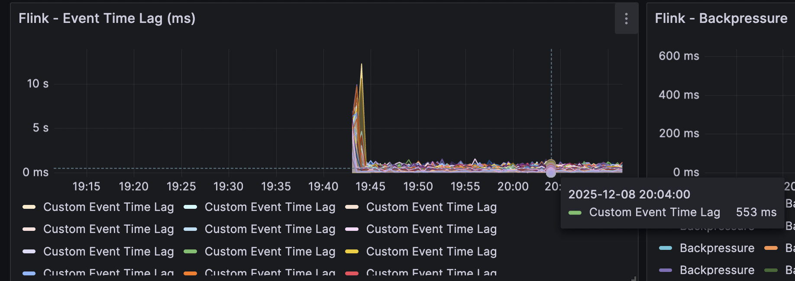
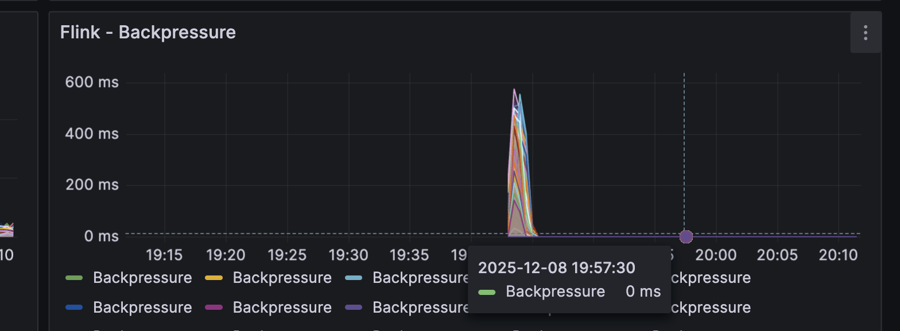
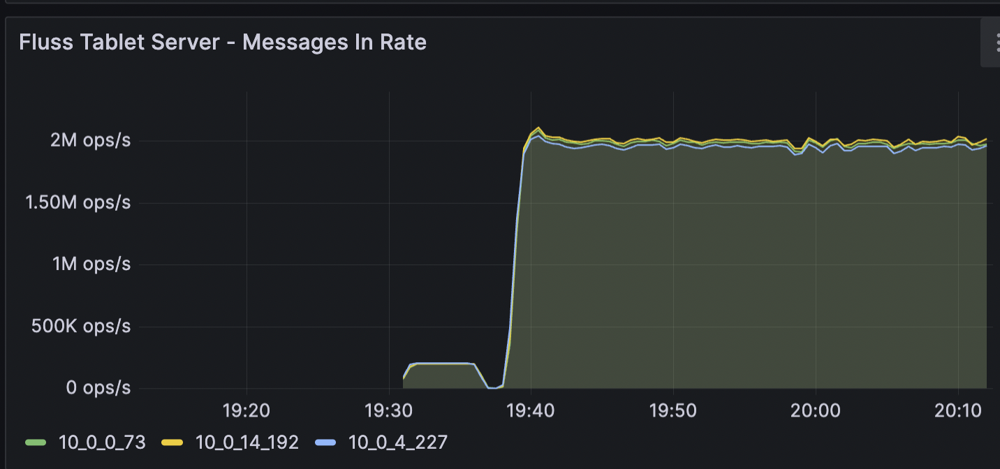
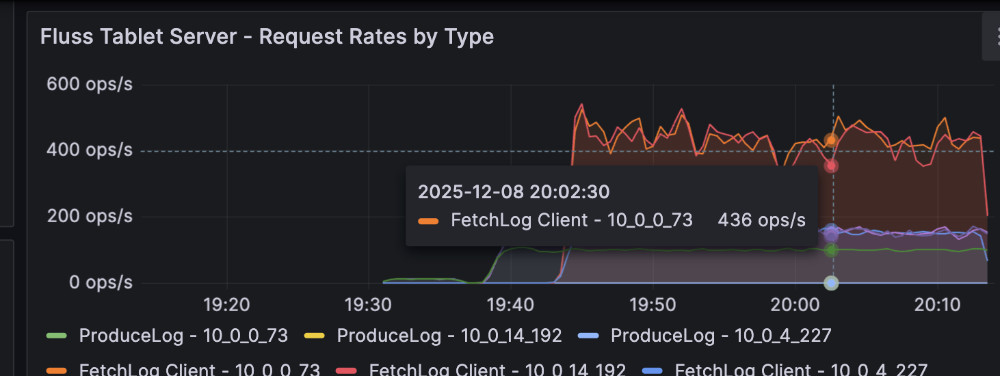
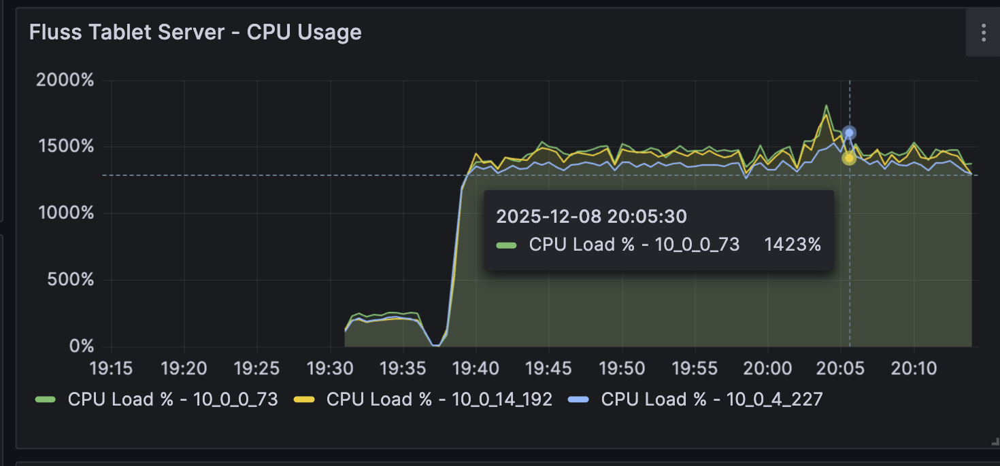
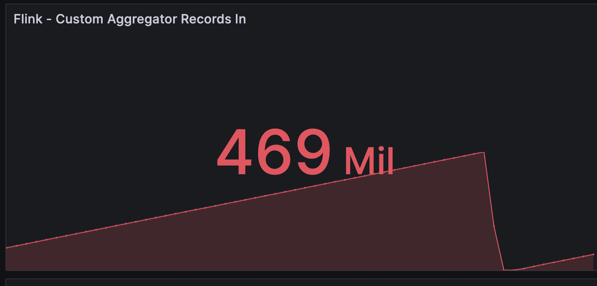
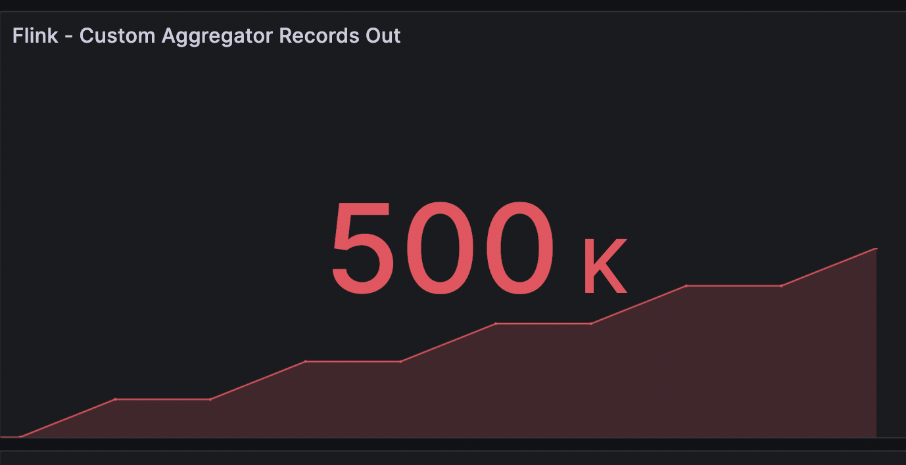

<!--
 Licensed to the Apache Software Foundation (ASF) under one or more
 contributor license agreements.  See the NOTICE file distributed with
 this work for additional information regarding copyright ownership.
 The ASF licenses this file to You under the Apache License, Version 2.0
 (the "License"); you may not use this file except in compliance with
 the License.  You may obtain a copy of the License at

    http://www.apache.org/licenses/LICENSE-2.0

 Unless required by applicable law or agreed to in writing, software
 distributed under the License is distributed on an "AS IS" BASIS,
 WITHOUT WARRANTIES OR CONDITIONS OF ANY KIND, either express or implied.
 See the License for the specific language governing permissions and
 limitations under the License.
-->


<!--
  2 Million Rows Per Second Benchmark Documentation
  ===================================================
  
  This README documents the benchmark setup and results for testing Fluss's capability
  to handle 2 million rows per second throughput with real-time Flink aggregation.
  
  Key Components:
  - 8 Producer Instances (250K records/sec each)
  - 100,000 Devices distributed across producers
  - Fluss Table with 128 partitions across 3 tablet servers
  - Flink Aggregation Job with 4 operators
  
  See bench-mark-images/ folder for performance diagrams and detailed metrics.
-->

# 2 Million Rows Per Second Benchmark

This benchmark demonstrates Fluss's capability to handle **2 million rows per second** throughput with real-time Flink aggregation processing.

## Overview

This benchmark setup consists of:
- **8 Producer Instances** generating sensor data at 250K records/sec each (2M total)
- **100,000 Devices** distributed across all producers
- **Fluss Table** with 128 partitions (buckets) across 3 tablet servers
- **Flink Aggregation Job** processing the data stream in real-time

## Producer Data Generation

### Device Distribution Logic

The producer uses a multi-instance architecture to distribute 100,000 devices across 8 producer instances:

**Key Implementation Details:**
- Total devices: **100,000** (constant across all instances)
- Total producers: **8 instances** (instance IDs: 0-7)
- Device ID range calculation per instance:
  ```java
  int devicesPerInstance = TOTAL_DEVICES / options.totalProducers;  // 100,000 / 8 = 12,500
  int startDeviceId = options.instanceId * devicesPerInstance;
  int endDeviceId = (options.instanceId == options.totalProducers - 1) 
          ? TOTAL_DEVICES  // Last instance gets remainder
          : (options.instanceId + 1) * devicesPerInstance;
  ```

**Device ID Ranges:**
- Instance 0: Devices 0 to 12,499 (12,500 devices)
- Instance 1: Devices 12,500 to 24,999 (12,500 devices)
- Instance 2: Devices 25,000 to 37,499 (12,500 devices)
- Instance 3: Devices 37,500 to 49,999 (12,500 devices)
- Instance 4: Devices 50,000 to 62,499 (12,500 devices)
- Instance 5: Devices 62,500 to 74,999 (12,500 devices)
- Instance 6: Devices 75,000 to 87,499 (12,500 devices)
- Instance 7: Devices 87,500 to 99,999 (12,500 devices)

**Rate Distribution:**
- Each producer instance generates **250,000 records/second**
- Rate is evenly distributed across all devices in the instance's range
- Each device generates approximately **20 records/second** (250,000 / 12,500)

**Producer Configuration:**
- Location: `high-infra/k8s/jobs/deploy-producer-multi-instance.sh`
- Each instance runs as a Kubernetes Job with:
  - Instance ID passed via `INSTANCE_ID` environment variable
  - Total producers count via `TOTAL_PRODUCERS` environment variable
  - Rate per instance: 250,000 records/sec
  - Writer threads: 48 threads per instance
  - Batch size: 128MB
  - Buffer memory: 2GB
  - Batch timeout: 90ms

## Fluss Table Configuration

### Table Details

**Table Schema:**
- **Database:** `iot`
- **Table:** `sensor_readings`
- **Primary Key:** `sensor_id` (INT)
- **Partitions:** 128 buckets (distributed by `sensor_id` hash)

**Table Columns:**
1. `sensor_id` (INT) - Primary key, maps to device ID (0-99,999)
2. `sensor_type` (INT) - Sensor type (1-8)
3. `temperature` (DOUBLE) - Temperature reading
4. `humidity` (DOUBLE) - Humidity reading
5. `pressure` (DOUBLE) - Pressure reading
6. `battery_level` (DOUBLE) - Battery level
7. `status` (INT) - Device status (1=online, 2=offline, 3=maintenance, 4=error)
8. `timestamp` (BIGINT) - Timestamp in milliseconds

**Table Distribution:**
- **Buckets:** 128 partitions
- **Distribution:** Hash-based on `sensor_id` primary key
- **Tablet Servers:** 3 replicas
- **Replication:** Data is replicated across tablet servers for high availability

**Tablet Server Configuration:**
- **Count:** 3 tablet servers
- **Instance Type:** i7i.8xlarge (or similar high-performance instance)
- **Storage:** Local NVMe drives for optimal I/O performance
- **Data Path:** `/opt/alldata/fluss/data` (mounted on NVMe)

**Table Creation:**
- Script: `high-infra/k8s/jobs/create-table.sh`
- Default buckets: 128
- Table is created before producer deployment
- Uses `distributedBy(buckets, "sensor_id")` for hash-based distribution

## Flink Aggregation Job

### Job Overview

The Flink job (`FlinkSensorAggregatorJob`) reads from the Fluss table, performs real-time aggregations, and outputs aggregated sensor data.

**Job Configuration:**
- **Parallelism:** 192 (distributed across 6 TaskManager pods)
- **TaskManager Slots:** 32 slots per TaskManager
- **Checkpointing:** Enabled with 5-minute intervals
- **Checkpoint Mode:** AT_LEAST_ONCE
- **State Backend:** S3-based (for fault tolerance)

### Flink Operators

The Flink job consists of **4 main operators**:

#### 1. FlussChangelogFilter
- **Type:** Filter operator
- **Function:** Filters changelog stream to only process INSERT and UPDATE_AFTER events
- **Input:** Raw changelog stream from Fluss table (includes INSERT, UPDATE_BEFORE, UPDATE_AFTER, DELETE)
- **Output:** Only INSERT and UPDATE_AFTER events
- **Purpose:** Ensures we only process new/updated records, ignoring DELETE and UPDATE_BEFORE events

#### 2. FlussSensorReadingMapper
- **Type:** Map operator (RichMapFunction)
- **Function:** 
  - Converts Fluss Row format to SensorReading object
  - Extracts sensor data from table columns
  - Calculates event time lag (difference between event time and processing time)
  - Emits custom metrics:
    - `records_in`: Counter for input records
    - `event_time_lag_ms`: Gauge for event time lag
- **Input:** Filtered Row objects from FlussChangelogFilter
- **Output:** SensorReading objects with enriched metadata
- **Metrics:** 
  - `flink_taskmanager_job_task_operator_fluss_aggregator_records_in`
  - `flink_taskmanager_job_task_operator_fluss_aggregator_event_time_lag_ms`

#### 3. TumblingWindowAggregation
- **Type:** Window operator with aggregation
- **Function:**
  - Groups records by `sensor_id` (keyBy operation)
  - Applies tumbling window of 1 minute (processing time)
  - Performs incremental aggregation:
    - **SensorAggregateFunction:** Incrementally aggregates:
      - Count of records
      - Sum of temperature, humidity, pressure, battery_level
      - Min/Max of temperature, humidity, pressure, battery_level
      - First/last timestamp
  - **WindowEnricher:** Finalizes window results:
    - Calculates averages (sum / count)
    - Computes time span (last - first timestamp)
    - Creates SensorAggregate object
- **Window Type:** TumblingProcessingTimeWindows (1 minute)
- **Input:** SensorReading objects from FlussSensorReadingMapper
- **Output:** SensorAggregate objects (one per sensor per window)
- **Optimization:** 
  - Disabled operator chaining for better parallelism
  - Optimized min/max calculations (direct comparisons)
  - Optimized average calculation (multiplication instead of division)

#### 4. FlussAggregatorSink
- **Type:** Sink operator (RichSinkFunction)
- **Function:**
  - Receives aggregated SensorAggregate objects
  - Increments output counter for every record
  - Logs aggregated results every 20,000 records
  - Emits custom metrics:
    - `records_out`: Counter for output records
- **Input:** SensorAggregate objects from TumblingWindowAggregation
- **Output:** Logged to Flink logs (can be extended to write to ClickHouse or other sinks)
- **Metrics:** 
  - `flink_taskmanager_job_task_operator_fluss_aggregator_records_out`
- **Optimization:**
  - Lazy evaluation of full record conversion (only when logging)
  - Uses LOG.info() instead of System.out.println for async logging
  - Disabled operator chaining for better resource isolation

### Data Flow

```
Fluss Table (sensor_readings)
    ↓
FlussChangelogFilter (filter INSERT/UPDATE_AFTER)
    ↓
FlussSensorReadingMapper (convert Row → SensorReading)
    ↓
TumblingWindowAggregation (1-minute windows, group by sensor_id)
    ↓
FlussAggregatorSink (log aggregated results)
```

### Performance Characteristics

- **Input Rate:** ~2 million records/second (from 8 producers)
- **Window Size:** 1 minute tumbling windows
- **Output Rate:** ~1,667 aggregates/second (100,000 devices / 60 seconds)
- **Latency:** Sub-second processing latency
- **Throughput:** Handles full 2M records/sec with optimized operators

## Benchmark Results

The following diagrams show detailed performance metrics from the 2 million rows per second benchmark run. Each diagram includes explanations of what it measures and what to look for.

### Deployment Diagram


**What it shows:**
This diagram illustrates the complete architecture and deployment topology of the benchmark setup. It shows:
- **Infrastructure Components:** AWS EKS cluster with multiple node groups including Fluss coordinator (1 instance), Fluss tablet servers (3 instances), Flink JobManager (1 instance), Flink TaskManagers (6 instances), Producer nodes (4 nodes with 8 producer instances), and Monitoring stack (Prometheus + Grafana)
- **Network Architecture:** VPC with public and private subnets, load balancers, service endpoints, and inter-component communication paths
- **Data Flow:** Producer → Fluss Tablet Servers → Flink (via Fluss catalog) → Aggregated Output
- **Storage:** S3 buckets for Flink checkpoints, NVMe storage for tablet servers, and EBS volumes for persistent data

**Key Insights:** Demonstrates the distributed nature of the setup, shows how data flows through the system, illustrates the separation of compute and storage layers, and highlights the scalability of the architecture.

---

### 1. Producer Throughput



**What it shows:**
This diagram monitors the data generation rate from all producer instances. It displays:
- **Total Records Per Second:** Aggregated rate from all 8 producer instances (target: 2,000,000 records/second)
- **Per-Instance Rates:** Individual producer instance throughput (250K per instance × 8)
- **Total Records:** Cumulative count of records generated over time
- **Time Series:** Shows throughput stability and consistency over the benchmark duration

**What to look for:**
- Consistent rate at or near 2M records/sec
- Minimal fluctuations indicating stable generation
- All 8 instances contributing equally
- No rate degradation over time

---

### 2. Flink Consumer



**What it shows:**
This diagram shows how Flink consumes data from the Fluss table. It displays:
- **Consumer Throughput:** Rate at which Flink reads from Fluss (should match producer rate ~2M records/sec)
- **Records In:** Number of records consumed per second
- **Consumer Lag:** Delay between data production and consumption (should be minimal, < 1 second)
- **Partition Distribution:** How data is distributed across Flink subtasks

**What to look for:**
- Consumer rate matching producer rate (~2M records/sec)
- Low and stable consumer lag
- Even distribution across Flink subtasks
- No backpressure indicators

---

### 3. Flink Overall Operator Throughput



**What it shows:**
This diagram shows throughput across all Flink operators in the pipeline. It displays:
- **Operator-Level Metrics:** Throughput for FlussChangelogFilter, FlussSensorReadingMapper, TumblingWindowAggregation, and FlussAggregatorSink
- **Records In/Out per Operator:** Shows data flow through each stage
- **Operator Utilization:** CPU and memory usage per operator
- **Parallelism Distribution:** How work is distributed across subtasks

**What to look for:**
- Consistent throughput across all operators
- No significant drops between operators (indicating no data loss)
- Balanced operator utilization
- Identification of any bottleneck operators

---

### 4. Flink End-to-End Data Lag



**What it shows:**
This diagram measures the latency from data production to final aggregation output. It displays:
- **Event Time Lag:** Difference between event timestamp and processing time (should be < 1 second)
- **Processing Latency:** Time taken for data to flow through Flink pipeline
- **Window Processing Delay:** Delay in window aggregation completion
- **End-to-End Latency:** Total time from producer to sink (should be sub-second)

**What to look for:**
- Low and stable event time lag (< 1 second)
- Consistent processing latency
- No lag spikes indicating bottlenecks
- Sub-second end-to-end latency

---

### 5. Flink Back Pressure



**What it shows:**
This diagram monitors backpressure indicators to identify bottlenecks in the Flink pipeline. It displays:
- **Backpressure Status:** Per-operator backpressure indicators (OK, LOW, HIGH)
- **Operator Busy Percentage:** CPU utilization per operator (should be < 100%)
- **Queue Sizes:** Input/output queue sizes for each operator
- **Idle Time:** Operator idle time (inverse of busy percentage)

**What to look for:**
- No backpressure (all operators showing OK status)
- Balanced operator busy percentages
- No operators stuck at 100% busy
- Healthy buffer utilization

---

### 6. Fluss Tablet Server Throughput



**What it shows:**
This diagram shows the throughput and performance of Fluss tablet servers handling writes. It displays:
- **Messages In Rate:** Rate at which tablet servers receive messages (should match producer rate ~2M messages/second)
- **Bytes In/Out Rate:** Data transfer rates to/from tablet servers
- **Write Throughput:** Aggregate write performance across all 3 tablet servers
- **Per-Server Metrics:** Individual tablet server performance

**What to look for:**
- Sustained 2M messages/second across tablet servers
- Even distribution across 3 tablet servers
- High write throughput
- No performance degradation

---

### 7. Fluss Tablet Server Request by Type



**What it shows:**
This diagram breaks down tablet server requests by operation type to understand workload patterns. It displays:
- **Request Types:** 
  - `produceLog`: Write operations (should be highest, matching producer write rate)
  - `fetchLogClient`: Read operations from Flink (matching Flink read rate)
  - `putKv`: Key-value operations
  - Other request types
- **Request Rates:** Requests per second per type
- **Request Distribution:** Percentage breakdown of request types
- **Per-Server Breakdown:** Request distribution across tablet servers

**What to look for:**
- High produceLog rate (matching producer write rate)
- Moderate fetchLogClient rate (matching Flink read rate)
- Balanced request distribution across tablet servers
- No unusual request patterns

---

### 8. Fluss Tablet Server CPU



**What it shows:**
This diagram monitors CPU utilization of tablet servers to ensure they're not bottlenecked. It displays:
- **CPU Usage:** CPU utilization percentage per tablet server (50-80% is healthy)
- **CPU Load:** System load average
- **JVM CPU:** Java process CPU usage
- **CPU Trends:** CPU usage over time

**What to look for:**
- Moderate CPU usage (50-80% is healthy)
- No CPU saturation (100% indicates bottleneck)
- Balanced CPU across all 3 tablet servers
- Stable CPU usage without spikes

---

### 9. Flink Aggregation Input



**What it shows:**
This diagram shows the input rate to the Flink aggregation operators (window and sink). It displays:
- **Aggregation Input Rate:** Records per second entering aggregation operators (~2M records/sec)
- **Window Input:** Records entering tumbling window operator (~2M per minute)
- **Key Distribution:** Distribution of records by sensor_id
- **Input Stability:** Consistency of input rate over time

**What to look for:**
- Consistent input rate (~2M records/sec)
- Stable input without drops
- Even key distribution
- No input rate spikes or gaps

---

### 9. Flink Aggregation Output



**What it shows:**
This diagram shows the output rate from Flink aggregation (aggregated results per window). It displays:
- **Aggregation Output Rate:** Aggregated records per second (~1,667/sec = 100K devices / 60 seconds)
- **Window Output:** Number of aggregates produced per window (~100K aggregates per 1-minute window)
- **Output Stability:** Consistency of output rate
- **Aggregation Efficiency:** Ratio of input to output records (input:output should be ~1200:1 for 1-minute windows)

**What to look for:**
- Consistent output rate (~1,667 aggregates/sec)
- One aggregate per device per window
- Stable output without gaps
- Proper aggregation (many input records → one output per device)

---

## Benchmark Summary

These diagrams collectively demonstrate:

1. **Producer Performance:** All 8 instances generating data at target rate (2M records/sec)
2. **Fluss Performance:** Tablet servers handling writes efficiently with balanced load
3. **Flink Performance:** Real-time processing with low latency and no backpressure
4. **End-to-End Latency:** Sub-second processing from producer to aggregated output
5. **System Stability:** Consistent performance throughout the benchmark duration
6. **Scalability:** System handling 2M records/sec with room for growth

### Key Performance Indicators

- **Throughput:** Sustained 2,000,000 records/second
- **Latency:** Sub-second end-to-end processing
- **Availability:** No data loss, no backpressure
- **Efficiency:** Balanced resource utilization across all components
- **Scalability:** Linear scaling with additional resources

## Infrastructure Costs

The benchmark infrastructure consists of the following AWS EC2 instances running 24/7 for one month (30 days):

### Instance Breakdown

1. **Fluss Tablet Servers (i7i.8xlarge)**
   - **Nodes:** 3 instances
   - **Hourly Cost:** $3.02 per hour
   - **Monthly Cost:** 3 × 24 × 30 × $3.02 = **$6,523.20**

2. **Flink TaskManagers (C5.4xlarge)**
   - **Nodes:** 6 instances
   - **Hourly Cost:** $0.68 per hour
   - **Monthly Cost:** 6 × 24 × 30 × $0.68 = **$2,937.60**

3. **Producer Nodes (C5.3xlarge)**
   - **Nodes:** 8 instances
   - **Hourly Cost:** $0.35 per hour
   - **Monthly Cost:** 8 × 24 × 30 × $0.35 = **$2,016.00**

### Total Monthly Cost

**Total Infrastructure Cost:** $6,523.20 + $2,937.60 + $2,016.00 = **$11,476.80/month**

*Note: This cost calculation does not include additional AWS services such as EKS cluster management, S3 storage, networking (VPC, NAT Gateway), load balancers, or monitoring stack (Prometheus/Grafana). Actual costs may vary based on AWS pricing changes and additional resource usage.*

## Deployment

For deployment instructions, see:
- `high-infra/k8s/DEPLOYMENT.md`
- `high-infra/DEPLOY-STEPS.md`

## Monitoring

Grafana dashboards are available for monitoring:
- Producer metrics (records/sec, total records)
- Flink metrics (input/output rates, event time lag, CPU/memory)
- Fluss metrics (tablet server throughput, coordinator status)

Access Grafana:
```bash
kubectl port-forward -n monitoring svc/prometheus-grafana 3000:80
# Open http://localhost:3000 (admin/admin123)
```

